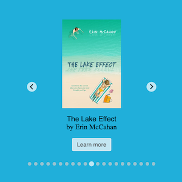
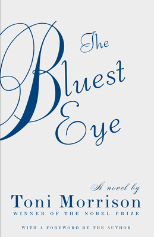

*Sample Choose to Read Ohio Widget*

# Choose to Read Ohio (Book Widget)
Choose to Read Ohio, a project of the State Library of Ohio, the Ohioana Library Association, and the Ohio Center for the Book, encourages public libraries, schools, families, and others to build a community of readers and an appreciation of Ohio authors, illustrators, and literature. CTRO is adaptable for use in classrooms, libraries, bookstores, by book discussion groups,  families, and other community groups.

The book widget is intended to promote and expand access to Choose To Read Ohio. The widget provides libraries a customizable platform to showcase books by Ohio authors and illustrators and to provide access to readers' toolkits and more. 

Visit the State Library of Ohio's website to read more about [Choose to Read Ohio](https://library.ohio.gov/services-for-libraries/library-programs-development/ctro/) or email your questions to [jdwyer@library.ohio.gov](mailto:jdwyer@library.ohio.gov).

## Usage

There are two ways to implement the book widget:
 1. Use one of the iframes (below) to drop into your library website _as is_.
 2. Download and customize the code on your own (the self-hosted option).

### Using an iframe
  

  
There are five versions of the widget that can be dropped in to your website _as is_ using a standard `iframe` tag in your website. Each version includes a "Learn More" button that links to the details for that title on the State Library of Ohio's website. Each version represents an intended audience:

1. `index.html` -- The default widget, displays all 20 titles.
2. `children.html` -- Books for Young Children only.
3. `tweens.html` -- Books for Tweens / Middle Grades only.
4. `teens.html` -- Books for Teens only.
5. `adults.html` -- Books for adults only.

#### Note on sizing
The width and height attributes can be modified, but `height="400"` is recommended for most cases. You can also set `width="100%"` so that the widget expands the width of its parent element:

```html
<iframe src="https://statelibraryofohio.github.io/ctro-book-widget/index.html" title="Choose to Read Ohio" 
        width="100%" height="400" frameborder="0" scrolling="no" style="margin:0 auto;"></iframe>
```

#### Examples

##### Widget for all titles

```html
<iframe src="https://statelibraryofohio.github.io/ctro-book-widget/index.html" title="Choose to Read Ohio"
        width="400" height="400" frameborder="0" scrolling="no" style="margin:0 auto;"></iframe>
```

##### Widget for children

```html
<iframe src="https://statelibraryofohio.github.io/ctro-book-widget/children.html" title="Choose to Read Ohio"
        width="400" height="400" frameborder="0" scrolling="no" style="margin:0 auto;"></iframe>
```  

##### Widget for teens

```html
<iframe src="https://statelibraryofohio.github.io/ctro-book-widget/teens.html" title="Choose to Read Ohio" 
        width="400" height="400" frameborder="0" scrolling="no" style="margin:0 auto;"></iframe>
```  

##### Widget for tweens / middle grades

```html
<iframe src="https://statelibraryofohio.github.io/ctro-book-widget/tweens.html" title="Choose to Read Ohio"
        width="400" height="400" frameborder="0" scrolling="no" style="margin:0 auto;"></iframe>
```  

##### Widget for adults

```html
<iframe src="https://statelibraryofohio.github.io/ctro-book-widget/adults.html" title="Choose to Read Ohio"
        width="400" height="400" frameborder="0" scrolling="no" style="margin:0 auto;"></iframe>
```  

### Customizing the Widget (Self-Hosted Option)
Anyone is welcome to pull the code directly from this repository to further customize the book widgets, but it must be hosted locally. In most cases, you will want to edit the default `index.html` markup to display only the titles you are interested in and to optionally add hyperlinks for titles in your local catalog.

#### Custom Slides / Catalog Links
For ease of editing, you can identify, edit, or remove the section for each CTRO title by looking for the commented code blocks, for example:

```html
<!-- Adults: Book #1 -->
<div class="splide__slide" role="group" aria-roledescription="slide" aria-labelledby="book-1">
  <div class="card">
    
    <div class="card-details">
      <p id="book-1" class="card-title">The Bluest Eye <span class="card-author">by Toni Morrison</span></p>
      <!--<a class="card-btn" href="" target="_blank">Request</a>-->
      <a class="card-btn" href="https://library.ohio.gov/books/the-bluest-eye/" target="_blank">Learn more</a>
    </div>
  </div>
</div>
```  

In the example above, you can also find a **Request** button has been commented out. If you would like to make discovery and requests for these titles in your local catalog easier for your visitors, uncomment the line and update the `href=` attribute with an appropriate hyperlink.


### Customizing the Behavior
You can also further customize the behavior of the widget by editing `js/main.js`.  
Details for each option can be found in the [SplideJS documentation](https://github.com/Splidejs/splide).

## Book Jacket Credits
Permission to use the book jacket images has been granted by the books' publishers.

## Software Credits
The development of this software was made possible using the following components:

[splidejs](https://github.com/Splidejs/splide) by Naotoshi Fujita. Licensed Under: MIT License

## License
The CTRO Book widget is released under the MIT license. © 2021 State Library of Ohio
